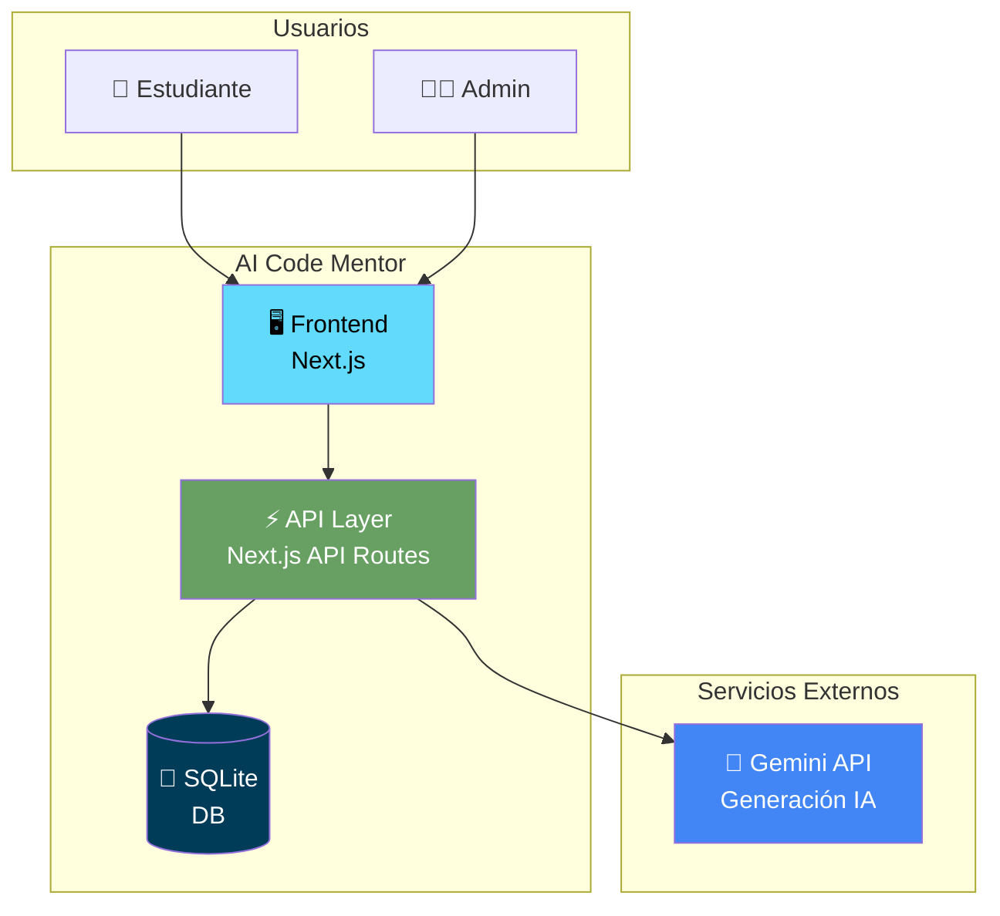
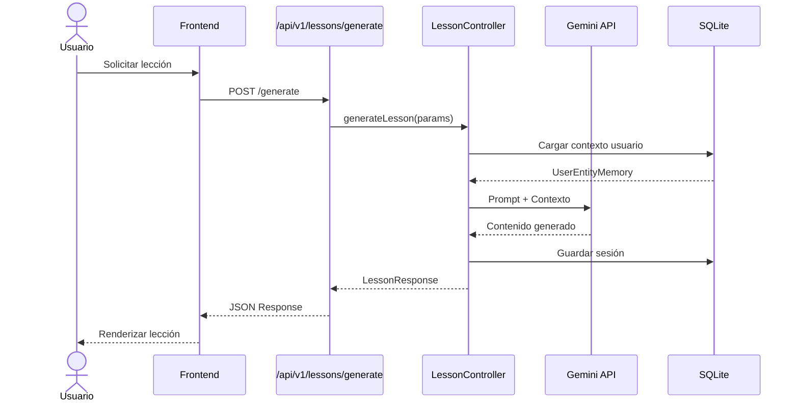
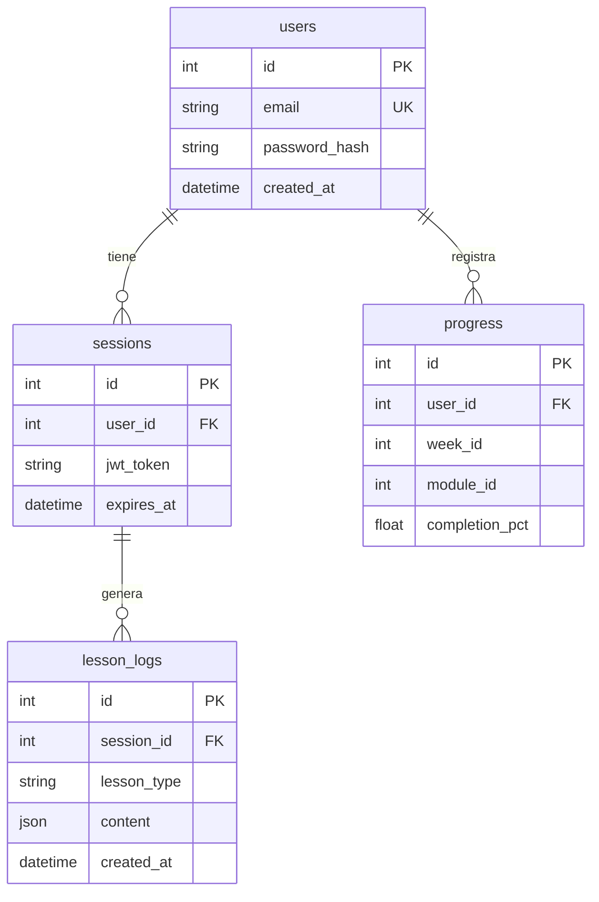
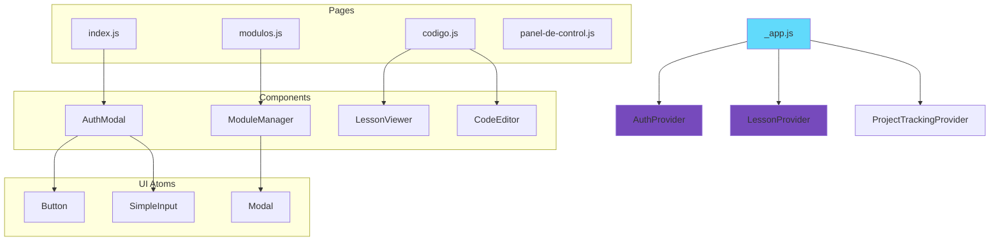
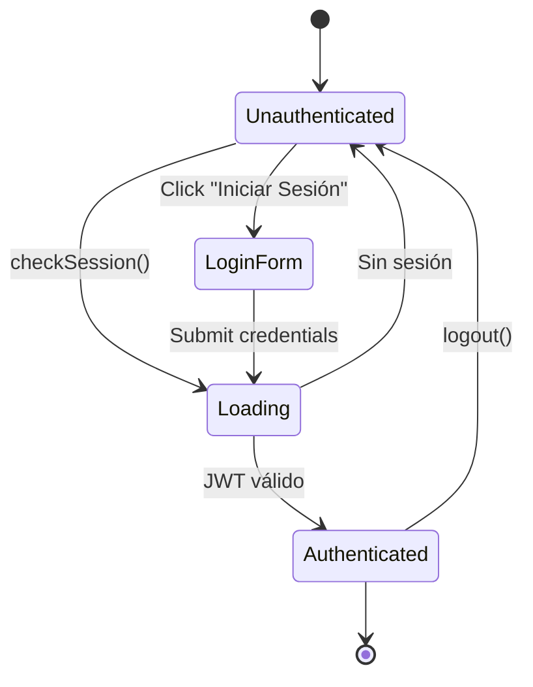

# Diagramas de Arquitectura - AI Code Mentor

## 1. Vista General del Sistema (C4 - Contexto)

---

## 2. Flujo de Generación de Lecciones (Secuencia)

---

## 3. Modelo de Datos (ERD Simplificado)

---

## 4. Jerarquía de Componentes Frontend

---

## 5. Flujo de Autenticación

---

> **Nota**: Estos diagramas usan [Mermaid](https://mermaid.js.org/) y se renderizan automáticamente en GitHub, VS Code, y la mayoría de viewers de Markdown modernos.
