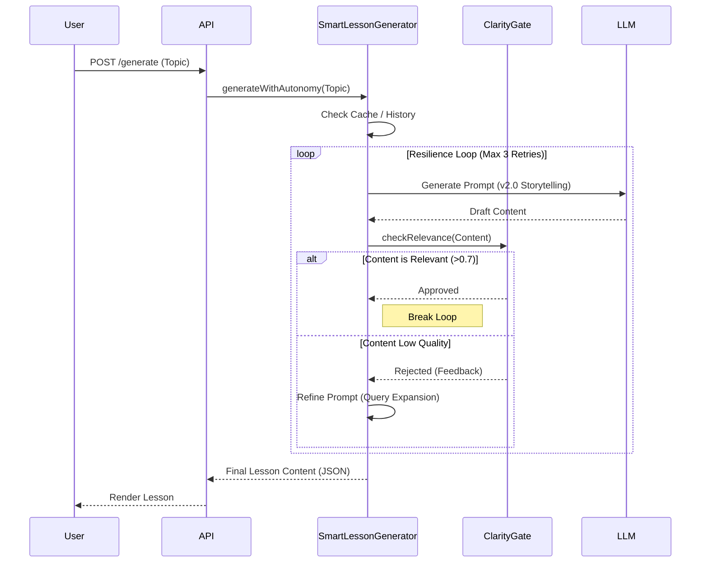
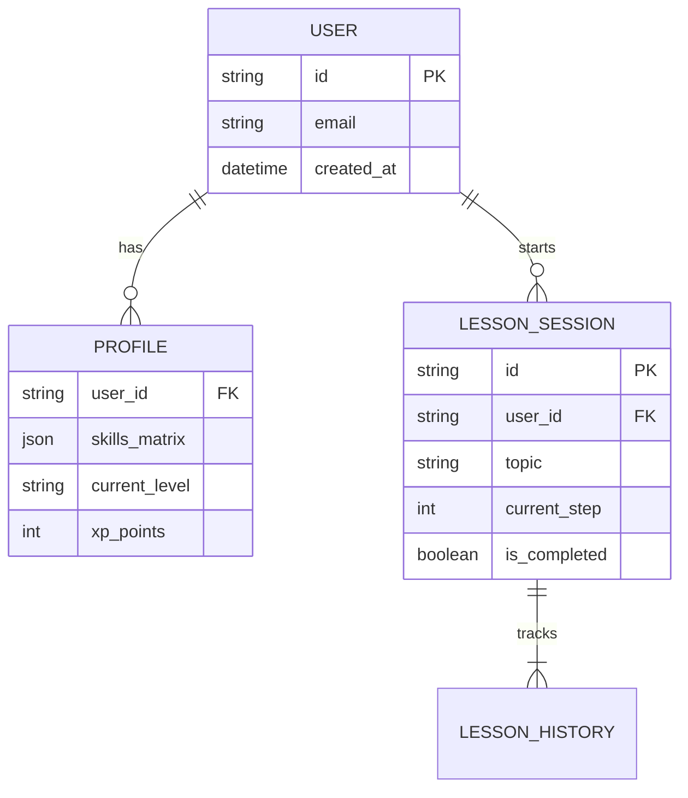

# Architecture Diagrams

## 1. System High-Level Overview

```mermaid
graph TD
    User[Developer / Student] -->|Access via Browser| Frontend[Next.js Frontend]
    Frontend -->|Auth (Supabase)| Auth[Auth Service]
    Frontend -->|API Request| API[Next.js API Routes]
    
    subgraph "Core Backend Services"
        API -->|Calls| LessonController[Lesson Controller]
        LessonController -->|Uses| SmartAgent[Smart Lesson Generator]
        LessonController -->|Uses| RAG[RAG Service]
    end
    
    subgraph "AI & Intelligence"
        SmartAgent -->|Queries| LLM[Google Gemini API]
        RAG -->|Retrieves| VectorDB[Vector Database / Semantic Search]
        SmartAgent -->|Validates| ClarityGate[Clarity Gate]
    end
    
    subgraph "Data Persistence"
        LessonController -->|Stores| DB[(PostgreSQL / File System)]
        API -->|Logs| Metrics[Observability Metrics]
    end
```

## 2. Agentic Lesson Generation Flow (Recursive)



## 3. Database Entity Relationship (Simplified)


