# Diagramas de Arquitectura - AI Code Mentor

## 1. Vista General del Sistema (C4 - Contexto)

```mermaid
graph TB
    subgraph Usuarios
        U[👤 Estudiante]
        A[👨‍💻 Admin]
    end

    subgraph "AI Code Mentor"
        FE[🖥️ Frontend\nNext.js]
        API[⚡ API Layer\nNext.js API Routes]
        DB[(💾 SQLite\nDB)]
    end

    subgraph Servicios Externos
        GEMINI[🤖 Gemini API\nGeneración IA]
    end

    U --> FE
    A --> FE
    FE --> API
    API --> DB
    API --> GEMINI

    style FE fill:#61DAFB,color:#000
    style API fill:#68A063,color:#fff
    style DB fill:#003B57,color:#fff
    style GEMINI fill:#4285F4,color:#fff
```

---

## 2. Flujo de Generación de Lecciones (Secuencia)

```mermaid
sequenceDiagram
    actor U as Usuario
    participant FE as Frontend
    participant API as /api/v1/lessons/generate
    participant LC as LessonController
    participant AI as Gemini API
    participant DB as SQLite

    U->>FE: Solicitar lección
    FE->>API: POST /generate
    API->>LC: generateLesson(params)
    LC->>DB: Cargar contexto usuario
    DB-->>LC: UserEntityMemory
    LC->>AI: Prompt + Contexto
    AI-->>LC: Contenido generado
    LC->>DB: Guardar sesión
    LC-->>API: LessonResponse
    API-->>FE: JSON Response
    FE-->>U: Renderizar lección
```

---

## 3. Modelo de Datos (ERD Simplificado)

---

## 4. Jerarquía de Componentes Frontend

---

## 5. Flujo de Autenticación

```mermaid
stateDiagram-v2
    [*] --> Unauthenticated
    
    Unauthenticated --> Loading: checkSession()
    Loading --> Authenticated: JWT válido
    Loading --> Unauthenticated: Sin sesión
    
    Unauthenticated --> LoginForm: Click "Iniciar Sesión"
    LoginForm --> Loading: Submit credentials
    
    Authenticated --> Unauthenticated: logout()
    Authenticated --> [*]
```

---

> **Nota**: Estos diagramas usan [Mermaid](https://mermaid.js.org/) y se renderizan automáticamente en GitHub, VS Code, y la mayoría de viewers de Markdown modernos.
