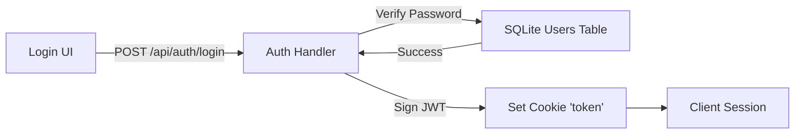
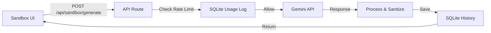

# 🏛️ ARQUITECTURA VIVA v20.0 - AI Code Mentor

**Fecha:** 2025-12-12
**Cambio Principal:** Local-First / SQLite Migration - Eliminación de Supabase
**Versión Anterior:** v19.3 (Sandbox Improvements)

---

## 🗂️ FUENTES DE VERDAD v20.0

### Documentación Arquitectónica

**ACTIVA (v20.0):**
1. ✅ **ARQUITECTURA_VIVA v20.0** (este documento) → **LÍNEA BASE ACTUAL**
2. 📚 **ARQUITECTURA_VIVA v19.3** → REFERENCIA HISTÓRICA
3. ✅ **docs/INSTALLATION_GUIDE.md** → GUÍA DE INSTALACIÓN ACTUALIZADA

---

## 📖 DIFERENCIAS ENTRE v19.3 Y v20.0

### Cambio: Migración a Local-First (SQLite)

**Por qué es v20.0 (Major Release):**

Se ha eliminado completamente la dependencia de **Supabase** para adoptar una arquitectura **Local-First** basada en **SQLite**. Esto simplifica el despliegue, elimina costos de servicios externos, mejora el rendimiento local y garantiza la privacidad total de los datos.

### 🔄 Componentes Modificados

#### Base de Datos Unificada
```
ANTES (v19.3):
Supabase (PostgreSQL - Remoto) + SQLite (Solo Currículo Estático)

AHORA (v20.0):
SQLite (better-sqlite3 - Local)
  └── Tablas de Usuarios y Autenticación
  └── Tablas del Sistema IRP (Reviews)
  └── Tablas de Progreso y Métricas
  └── Tablas del Currículo (Unificadas)
```

#### Autenticación
```
ANTES (v19.3):
Supabase Auth (@supabase/ssr) + RLS

AHORA (v20.0):
Autenticación Nativa (JWT)
  └── lib/auth/auth.js: Generación y validación de tokens JWT
  └── Middleware local: Validación de cookies 'token'
  └── Password Hashing: bcryptjs
```

#### Sistema IRP (Peer Review)
```
ANTES (v19.3):
Cliente Supabase → POST REST API

AHORA (v20.0):
Direct DB Access (SQLite) → API Routes Unificadas
```

### 🤖 Auto-Setup Local

Se ha consolidado la inicialización en el arranque (`npm run dev`):

- **DB Init:** Verifica/Crea `lib/db/curriculum.db`.
- **Schema:** Aplica automáticamente el esquema relacional completo.
- **Micro-Migrations:** Verificaciones de integridad en cada arranque.
- **Demo User:** Creación automática de `demo@aicodementor.com`.

---

## 🧪 Estructura de Datos (SQLite)

### Schema Principal

| Tabla | Descripción |
|-------|-------------|
| `users` | Credenciales y perfiles (bcrypt hash) |
| `progress` | Tracking de avance por módulo/fase |
| `competency_log` | Registro de habilidades adquiridas |
| `sandbox_generations`| Historial de lecciones generadas por IA |
| `irp_reviews` | Solicitudes de revisión de código |
| `modules/lessons` | Contenido estático del curso |

---

## 🎯 Flujo de Datos v20.0

### Autenticación


### Sandbox (IA Generation)


---

## ✅ Certificación v20.0

### Checklist Migración
- [x] Eliminación de paquetes `@supabase/*`
- [x] Implementación `lib/db.js` (Wrapper SQLite)
- [x] Migración de Endpoints (Profile, Progress, IRP)
- [x] Sistema de Auth Local (JWT + Cookies)
- [x] Actualización de Tests E2E

### Build Status
- ✅ `npm run build` - Exit code 0 (Sin dependencias externas)
- ✅ E2E Tests - Passing (Auth Local verificado)

---

## 📚 Referencias

- [README.md](../../README.md)
- [INSTALLATION_GUIDE.md](../INSTALLATION_GUIDE.md)

---

> **Nota:** v20.0 representa un cambio de paradigma hacia la soberanía de datos y la simplicidad operativa.
